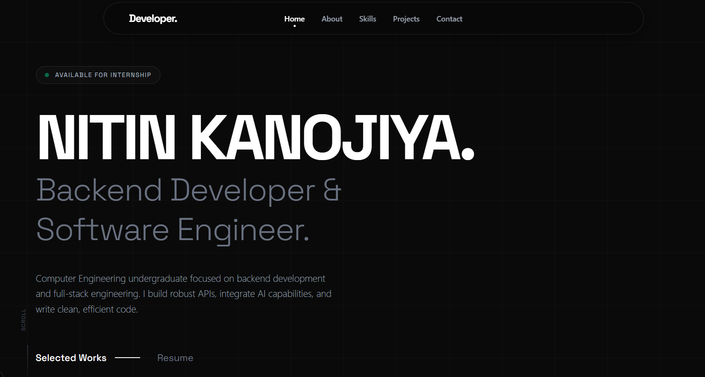

# 🚀 Nitin Kanojiya | Software Engineer Portfolio

<div align="center">
  
</div>

## 🌌 Overview
A highly interactive, premium, dark-themed portfolio designed for a Backend Developer & Software Engineer. 
Built to impress with cutting-edge web technologies, real-time API integrations, and 3D WebGL elements.

## ✨ Features
- **3D Interactive Elements:** Real-time WebGL Globe and Black Hole physics using `cobe` and HTML5 Canvas.
- **Fluid Animations:** Smooth scroll and reveal animations powered by `framer-motion`.
- **Responsive Design:** 100% fluid scaling for mobile, tablet, and desktop environments.
- **Live IP Tracking:** Dynamically fetches user location via IP API and perfectly aligns the 3D globe to face the user.
- **Live Time Sync:** Real-time ticking clock synchronized to `Asia/Kolkata` time.
- **Dark Mode By Default:** A deep, immersive `#0a0a0a` aesthetic with neon cyan and white accents.

## 🛠️ Tech Stack
- **Framework:** Next.js (App Router)
- **Styling:** Tailwind CSS
- **Animations:** Framer Motion
- **3D Graphics:** Cobe (WebGL Globe)
- **Language:** TypeScript
- **Icons:** Lucide React & React Icons

## 🚀 Getting Started

1. **Clone the repository**
   ```bash
   git clone https://github.com/Nitin-kanojiya26/portfolio.git
   ```
2. **Install dependencies**
   ```bash
   npm install
   ```
3. **Run the development server**
   ```bash
   npm run dev
   ```
4. **Open your browser**
   Navigate to [http://localhost:3000](http://localhost:3000) to see the magic.

## 📡 Live Demo
[Deploy your site to Vercel and put your live link here!]

## 📄 License
This project is open-source and available under the MIT License.

---
*Designed & Built by [Nitin Kanojiya](https://github.com/Nitin-kanojiya26)*
